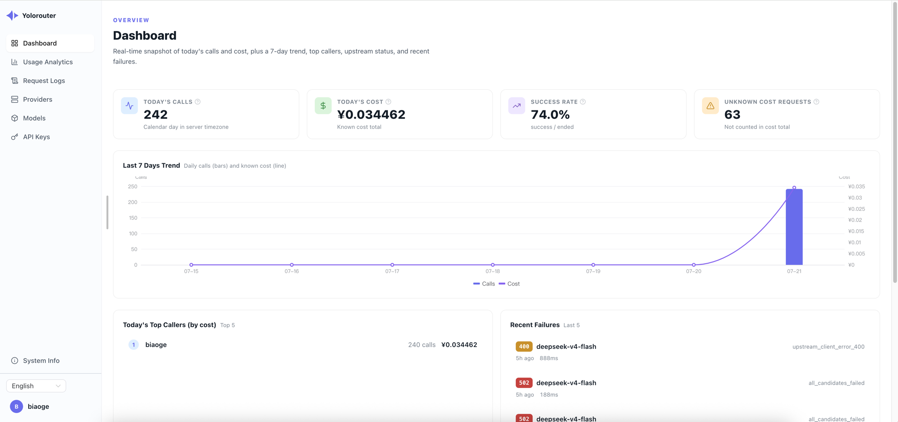
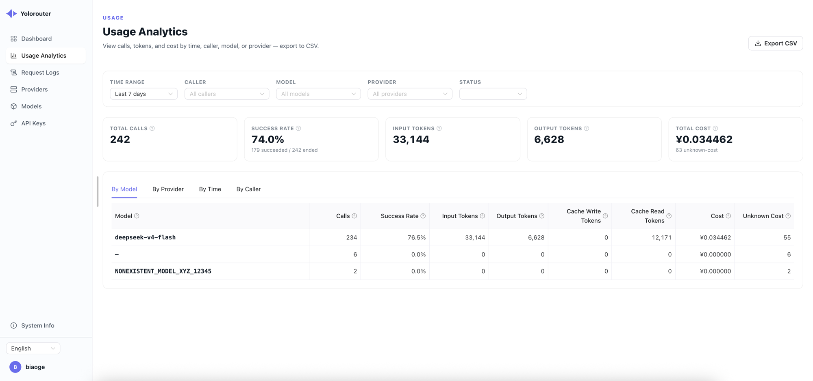

<div align="center">

# Yolorouter

**Run Claude Code (or any AI CLI) on any provider — a free, self-hosted LLM gateway in one binary that speaks the four chat wire protocols plus the OpenAI Images and Videos APIs, fails over across providers, pools upstream keys, and ships with a multi-user admin console.**

[](LICENSE)
[](https://github.com/yolorouter/yolorouter/actions/workflows/ci.yml)
[](https://goreportcard.com/report/github.com/yolorouter/yolorouter)
[](https://github.com/yolorouter/yolorouter/releases)
[](go.mod)

English · [简体中文](README_zh.md)

[Quick start](#quick-start) · [Protocols](#protocols) · [Cost optimization](#cost-optimization) · [Documentation](#documentation) · [Contributing](#contributing)

⚡ **Low-overhead streaming proxy** · 🔀 **Any protocol in, any protocol out** · 🆓 **Free & open-source** · 📦 **Single binary, zero external deps** · 🔁 **Automatic failover + key pool** · 👥 **Multi-user with SSO** · 💰 **Cost analytics & optimization**

</div>

---

Point your application at **one** endpoint and **one** API key. Yolorouter sits
between your apps and your upstream providers, so the messy parts live in one
place instead of scattered across every codebase: juggling provider accounts,
rotating rate-limited keys, failing over when an account breaks, enforcing
per-key budgets, and knowing what everything costs.

It accepts **four wire protocols** (OpenAI Chat Completions, OpenAI Responses,
Anthropic Messages, and Gemini `generateContent`) and can translate any of
them to any other on the way out. An OpenAI-only provider can serve Claude
Code; an Anthropic-only provider can serve the OpenAI SDK. Streaming, tool
calling, and reasoning/thinking blocks all survive the trip, as does image
content on every ingress except Responses (see [Protocols](#protocols)).

Everything ships as a **single binary** with the web console embedded. There is
no Node runtime to install and no separate frontend deploy. SQLite works out of
the box; switch to PostgreSQL when you want it.

## Why Yolorouter

**Routing**

- **Multi-provider failover.** Map one public model name (e.g. `smart`) to an ordered list of provider candidates. When one is down, requests fail over to the next; the caller never sees a different model name.
- **Per-model scheduling mode: failover / balanced.** Failover (the default) is primary-first — the top candidate takes all traffic. Switch a model to balanced and caller API keys are spread evenly across providers, each key sticking to one provider so upstream prompt caches stay warm. See [Scheduling modes](#scheduling-modes).
- **Upstream key pool.** Give each provider a pool of upstream keys and load spreads across it round-robin. A rate-limited key is benched for its `Retry-After` window (later requests walk healthier keys first); unauthorized or quota-exhausted keys are taken out until a retest passes.
- **One-click model import.** After you add a provider, the gateway fetches its live model catalogue — tick the models you want and import them all at once. Every imported mapping is verified against the real upstream in the background and auto-enabled when it passes; failures keep their diagnostic for a one-click retest. Suggested prices come from a community-maintained [price catalog](https://github.com/yolorouter/price-catalog) that refreshes daily, so most models arrive pre-priced.
- **Model aliasing.** Callers request a stable public name; each provider candidate maps it to whatever model id that provider actually expects. Candidate mappings are probed against the real upstream when you save them, so a typo is caught at configuration time, not at 3 a.m.
- **Image & video generation.** The OpenAI Images and Videos APIs are served beside chat. Images bill per delivered image through a quality×size price table (or by tokens); videos are a job dialect — `POST /v1/videos` returns a pollable job, settlement charges per second against a resolution-tiered table when completion is observed, and a key's budget reserves every in-flight job's priced bound. Providers whose native media APIs are not OpenAI-shaped are spoken natively: DashScope (wan video, qwen-image), Volcengine Ark (Seedance video, Seedream images), Kling (`kling-3.0`-family video, `kling-v3` images, and the multi-reference Omni pair — caller-side kling-native fields like `image_list` ride through verbatim), and MiniMax (`MiniMax-H3` / `MiniMax-H3-Max` video through the V2 task API — text-to-video and first-frame image-to-video; note H3-Max generates 5-to-15-second clips, so a 4-second ask is refused for that model; the same host serves the chat dialect, so key verification falls back to the video probe when the chat probe cannot serve the model). Keys on media-only accounts are verified through real media probes when a chat probe cannot serve the model.
- **Vision fallback.** Let text-only models "see". Mark a model as unable to read images and pick a vision model in the console; images in incoming requests are described by the vision model and forwarded as text, transparently to the caller, on every ingress protocol. With no vision model configured, images degrade to a clear placeholder instead of an upstream error.
- **Streaming done right.** Key rotation and failover happen *before* the first byte reaches the client; once streaming starts, the provider is locked in. Content from two providers is never stitched into one response.
- **Timeouts tuned for reasoning models.** Seven independent, configurable phases instead of one wall clock, so a model that thinks for eight minutes before emitting a token isn't killed mid-thought.

**Control & cost**

- **Per-key access control.** Model allowlists, rate and concurrency limits, cumulative budget caps, optional expiry, instant revocation.
- **Multi-user with SSO.** Team members sign in through any OAuth2/OIDC provider (Zitadel, GitHub, Keycloak, DingTalk, Feishu, ... — see the [DingTalk / Feishu setup guide](docs/dingtalk-feishu-login.md)) with accounts created on first login, or an admin provisions local username/password accounts straight from the console — no invites either way. Members manage their own API keys and see only their own usage and costs; admins see everything, can filter every statistic by account, and can create, promote, demote, or disable accounts. Disabling an account signs it out and turns off all of its keys instantly.
- **Cost optimization.** Inject a custom system prompt globally or per key; compress bulky tool output before it reaches the upstream. The console reports compression's measured savings, and for the system prompt the cost and output tokens it is projected to save over the selected period, backed by a published benchmark.
- **Built-in observability.** Token and cost KPIs, usage by model / provider / time / account / key, and request logs with the full per-attempt routing chain. Any view exports to CSV.
- **Bilingual console.** English and 简体中文, switchable anywhere; timezone follows the browser.
- **Self-update.** The binary can check for and apply new releases.

## Screenshots

<div align="center">
  
  
</div>

## Quick start

### Docker

```bash
docker run -d --name yolorouter --restart unless-stopped \
  -p 8080:8080 -v "$PWD/yolorouter:/yolorouter" \
  ghcr.io/yolorouter/yolorouter:latest
```

Or grab [docker-compose.yml](docker-compose.yml) and run `docker compose up -d`.
Images are published for amd64 and arm64 with every release.

Everything the container writes lives in the one mounted folder: the generated
`configs/config.yaml` (including the key that encrypts your upstream keys) and
the SQLite database. Back up that folder and you have backed up the deployment.

**Upgrading with docker compose:**

```bash
docker compose pull   # download the newest image; the running container is untouched
docker compose up -d  # recreate the container on the new image (does nothing if already newest)
```

**Upgrading with plain `docker run`** takes three steps. This is safe because a
container's filesystem is disposable by design: none of your state lives inside
the container — config and database sit in the mounted folder on the host and
survive the container being deleted.

```bash
# 1. Download the newest image. The running container keeps serving meanwhile —
#    this only fetches bytes to the local image store.
docker pull ghcr.io/yolorouter/yolorouter:latest

# 2. Stop and delete the old container. Your data is NOT in it: everything
#    lives in the mounted folder on the host and stays put.
docker rm -f yolorouter

# 3. Start a new container — the exact same command as the first run, mounting
#    the same folder. It picks up the image pulled in step 1.
docker run -d --name yolorouter --restart unless-stopped \
  -p 8080:8080 -v "$PWD/yolorouter:/yolorouter" \
  ghcr.io/yolorouter/yolorouter:latest
```

Two details worth knowing:

- Run step 3 **from the same directory** you originally started the container
  in — the `-v "$PWD/yolorouter:/yolorouter"` mount resolves relative to your
  current directory, and a different directory means an empty data folder and a
  fresh setup screen. Using an absolute path in `-v` avoids the pitfall
  entirely.
- On its first start the new version applies any pending database migrations
  automatically, then serves as before. If you ever need to go back to an older
  version *after* it has migrated the database, restore the data folder from a
  backup taken before the upgrade rather than just starting an older image — an
  old binary may not understand the newer schema. To stay on a fixed version in
  the first place, use a pinned tag (e.g. `...:v0.1.6`) instead of `:latest`.

### Install as a system service

No Docker, or want the built-in self-updater? Install as a background service
that starts on boot: systemd on Linux, launchd on macOS, a scheduled task on
Windows.

```bash
# Linux / macOS
curl -fsSL https://get.yolorouter.com/install.sh | bash
```

```powershell
# Windows, PowerShell 5.1+
irm https://get.yolorouter.com/install.ps1 | iex
```

On Windows, an elevated PowerShell installs a system-wide service that starts at
boot; a normal one installs under your account and starts at logon.

> **🇨🇳 China mirror**: if GitHub is slow or unreachable from your network, swap
> `get.yolorouter.com` for `gh.yolorouter.com`. Same installers, routed through a
> Cloudflare proxy, and auto-updates keep using the mirror afterwards.

Re-run the same command to upgrade; configuration and database are preserved and
the database is backed up first. Prefer a plain binary? Grab a
[release](https://github.com/yolorouter/yolorouter/releases) and run
`./yolorouter serve` (`.\yolorouter.exe serve` on Windows).

### First run

Whichever way you start it, the first run generates `configs/config.yaml`,
applies migrations and starts the console on port 8080. Create the first admin
account, then follow the guided flow: add a provider with its upstream key —
the console then fetches that provider's model catalogue so you can import the
models you want in one click. Each imported model is verified against the real
upstream in the background and enabled automatically once it passes. Finally,
issue an API key and start calling.

→ **Full installation guide for every platform, including building from source:**
[yolorouter.com/docs/self-hosted/installation](https://yolorouter.com/docs/self-hosted/installation?utm_source=oss-readme&utm_medium=repo)

## Protocols

Every ingress below authenticates with the **same** Yolorouter API key, supports
streaming, and can be served by **any** configured provider, no matter which
protocol that provider natively speaks.

| Ingress route | Protocol | Accepted auth headers |
| --- | --- | --- |
| `POST /v1/chat/completions` | OpenAI Chat Completions | `Authorization: Bearer`, `X-Api-Key` |
| `POST /v1/responses` | OpenAI Responses | `Authorization: Bearer`, `X-Api-Key` |
| `POST /v1/messages` | Anthropic Messages | `Authorization: Bearer`, `X-Api-Key` |
| `POST /v1/images/generations` | OpenAI Images (generation) | `Authorization: Bearer`, `X-Api-Key` |
| `POST /v1/images/edits` | OpenAI Images (edit) | `Authorization: Bearer`, `X-Api-Key` |
| `POST /v1/videos`, `GET /v1/videos/{id}`, `GET /v1/videos/{id}/content` | OpenAI Videos (job dialect) | `Authorization: Bearer`, `X-Api-Key` |
| `POST /v1/audio/speech` | OpenAI Speech | `Authorization: Bearer`, `X-Api-Key` |
| `POST /v1beta/models/{model}:generateContent`<br>`POST /v1beta/models/{model}:streamGenerateContent` | Gemini | `x-goog-api-key`, `?key=`, `Authorization: Bearer`, `X-Api-Key` |
| `GET /v1/models`, `GET /v1/models/{model}` | Model discovery | `Authorization: Bearer`, `X-Api-Key` |

The images ingress serves models declared with the **image** output modality in
the console. OpenAI-compatible providers are passed through as-is; providers on
a DashScope or Kling host are served through their native task dialects,
answered synchronously in the OpenAI shape (URL answers only — a `b64_json`
request is refused per candidate). Image models bill either per delivered image
through a quality×size price table or by token counts, whichever the candidate
declares, and a request that delivered nothing bills nothing. Edits take the
OpenAI multipart upload; on a DashScope host the reference images re-encode
into the native dialect (a mask upload is refused there — the dialect has no
field for it), and `gpt-image-*` models stream progressive partials as named
SSE events.

The videos ingress is a job dialect: `POST /v1/videos` submits a generation and
returns a job resource the caller polls at `GET /v1/videos/{id}`, downloading
the finished clip from `GET /v1/videos/{id}/content`. The official OpenAI SDK
works unchanged (`create_and_poll` drives the loop). Settlement happens once,
when completion is first observed, charging the seconds the upstream actually
delivered against the resolution tier the request's size maps to — failed,
cancelled, and expired jobs bill nothing. Video upstreams are task dialects
(DashScope wan, Ark Seedance, Kling new-design endpoints, MiniMax V2); submitted
jobs are never re-submitted to another candidate, because an accepted task
renders at the operator's cost whether or not the caller is ever billed. MiniMax
notes: `MiniMax-H3-Max` accepts 5–15 second clips (a 4-second ask is refused
with that reason), its largest outputs are 768P while `MiniMax-H3` rides the
large door sizes up to 2K, and task queries are answerable for 7 days — beyond
that a pending job expires unbilled — and finished-clip links are
time-limited (the vendor states no duration), so download or re-host
promptly. Video generation on MiniMax bills the pay-as-you-go balance (Token
Plan subscriptions, credit packs, and the Hailuo video resource packs do not
cover the H3 models).

The speech ingress serves models declared with the **audio** output modality:
one JSON request in the OpenAI shape — `model`, `input`, and `voice` required,
optional `response_format` (`mp3`, `opus`, `aac`, `flac`, `wav`, `pcm`) and
`speed` — binary audio out, forwarded as it arrives. Most bases are spoken to
in the OpenAI speech shape itself; three hosts carry their own dialect —
SiliconFlow (`mp3/opus/wav/pcm`, `mp3` the default, billed per UTF-8 byte of
input), Zhipu (`wav/pcm` only, `wav` the default an unspecified caller gets),
and MiniMax (the `t2a_v2` endpoint: `mp3/pcm/wav/flac/opus` with `mp3` the
default, voice and speed inside `voice_setting`, audio arriving hex-encoded
in a JSON envelope the gateway decodes). Candidates bill per million counted
characters, metered in the settling provider's own counting rule — at MiniMax
the envelope's own `usage_characters` prices the bill when present — so the
same model behind different providers' candidates may meter the same text
differently; the request log's usage detail names the meter each bill used.
A speech request never fails over to another provider: the voice is the
caller's own choice and voices do not travel between vendors, so a failure is
an error the caller can act on, not a different voice. Input length limits
are the upstream's (MiniMax 10,000 characters, Zhipu 1,024) and answered with
the upstream's own error; `instructions` and `stream_format` are refused at
the door — none of the wired dialects serves them, and silently dropping a
field the caller set would let them believe it took effect.

The `model` in every request is the **public name** you configured. Yolorouter picks
a provider candidate, swaps in the real upstream model id, and keeps your public
name in the response.

> **Known limitation**: `input_image` entries on the Responses ingress are dropped
> when the request has to be translated to a different egress protocol; only text is
> forwarded. Same-protocol passthrough is unaffected, and image content translates
> correctly on the other three ingresses.
>
> **Media notes**: image `stream` is a `gpt-image-*` family capability — other
> families answer a streaming ask with 400. Returned image and video URLs come
> from the upstream and follow the upstream's expiry (Yolorouter proxies, never
> rehosts); video jobs have no cancellation surface — none of the wired task
> dialects exposes one.

### Point existing SDKs and tools at it

Because the ingresses are the real native protocols, official SDKs and agent tools
need two settings changed and no adapter layer:

```python
# OpenAI Python SDK
from openai import OpenAI

client = OpenAI(base_url="http://localhost:8080/v1", api_key="sk-yr-your-key")
print(client.chat.completions.create(
    model="smart",
    messages=[{"role": "user", "content": "Hello!"}],
).choices[0].message.content)
```

```bash
# Claude Code — routed through Yolorouter to whichever provider you configured
export ANTHROPIC_BASE_URL=http://localhost:8080
export ANTHROPIC_AUTH_TOKEN=sk-yr-your-key
claude
```

→ **Per-protocol request examples and setup guides for 19 agent tools**
(Claude Code, Cursor, Codex CLI, Cherry Studio, Gemini CLI, opencode …):
[yolorouter.com/docs](https://yolorouter.com/docs?utm_source=oss-readme&utm_medium=repo)

## Scheduling modes

Every model routes through an ordered list of provider candidates; its
scheduling mode decides which candidate a request enters first.

- **Failover** (the default) is primary-first: the head of your configured
  order takes all traffic, and the rest of the chain exists for when it
  fails. Every model works this way until you switch it.
- **Balanced** spreads caller API keys evenly across providers. Each key is
  assigned to the provider currently holding the fewest keys, then sticks to
  it: multi-turn conversations from one key keep hitting the same provider,
  so upstream prompt caches stay warm — hopping providers mid-conversation
  would re-bill every cached token. (What the gateway guarantees is provider
  affinity; whether a cache hit follows also depends on the provider's key
  pool — upstream keys from different upstream accounts do not share a
  cache.) When a bound provider trips the circuit
  breaker, keys that send requests during the outage re-bind elsewhere
  (dormant keys keep their old spot until they next call); a recovered
  provider therefore holds fewer bindings and attracts new assignments
  first, healing the spread without a rebalancer. The model detail page
  shows the current per-provider binding counts (a point-in-time snapshot,
  refreshed when the page loads).

Everything else — failure handling, key rotation, circuit breaking, budgets —
is identical in both modes.

**Known limitation:** bindings live in process memory. A restart simply
reassigns keys (converging back to the same even spread), and in a
multi-instance deployment each instance computes its own spread — there is no
cross-instance binding table. During a rolling upgrade from a version
without scheduling modes, not-yet-upgraded instances run every model as
failover — switch a model to balanced after the whole fleet is upgraded.
The binding table holds up to 4096
(key, model) pairs across all models; beyond that, the least-recently-used
binding is evicted and its key reassigned on its next request, so extremely
wide deployments (hundreds of keys times dozens of balanced models) trade
some stickiness at the margin.

## Cost optimization

Both features are off by default, configured globally in the console, and
overridable per API key.

**Custom system prompt injection.** Append house rules to every request's system
prompt without touching client code. The injection follows the caller's own protocol
shape and is deterministic, so repeated requests produce byte-identical system
content and still hit upstream prompt caches. The console's projected savings
for this feature are backed by a published paired on/off benchmark — the
method and all 150 raw measurement pairs live in
[docs/concise-output-benchmark.md](docs/concise-output-benchmark.md).

**Input compression.** Coding agents send back huge, highly redundant tool output.
Yolorouter recognizes what each content block is (`go test` output, git diffs,
grep results, plain logs) and strips the noise while keeping the signal: failures,
stack traces, and each distinct match all survive. It never touches the active edit
region at the tail of the conversation, and only replaces a block when the compressed
form is actually shorter.

Cache-read and cache-write tokens are metered and priced separately throughout the
dashboard, so prompt-cache savings are a number you can see rather than a feeling.

→ **Details and tuning:**
[yolorouter.com/docs/self-hosted/configuration](https://yolorouter.com/docs/self-hosted/configuration?utm_source=oss-readme&utm_medium=repo)

## Documentation

| Topic | Link |
| --- | --- |
| Installation (all platforms, from source) | [Installation](https://yolorouter.com/docs/self-hosted/installation?utm_source=oss-readme&utm_medium=repo) |
| Every `config.yaml` field and the CLI | [Configuration](https://yolorouter.com/docs/self-hosted/configuration?utm_source=oss-readme&utm_medium=repo) |
| Upgrading, rolling back, uninstalling | [Updating](https://yolorouter.com/docs/self-hosted/updating?utm_source=oss-readme&utm_medium=repo) |
| Layering, protocol IR, storage | [Architecture](https://yolorouter.com/docs/self-hosted/architecture?utm_source=oss-readme&utm_medium=repo) |
| API reference and model catalogue | [Docs home](https://yolorouter.com/docs?utm_source=oss-readme&utm_medium=repo) |
| DingTalk / Feishu login setup | [DingTalk / Feishu login](docs/dingtalk-feishu-login.md) |

Self-hosting means bringing your own upstream API keys. If you would rather not sign
up with every provider separately, **YoloRouter Cloud** ships in the console's provider
preset list as one more upstream you can select; see
[the hosted option](https://yolorouter.com/pricing?utm_source=oss-readme&utm_medium=repo).

## Build from source

Requires **Go 1.25.7+** and **Node.js 22.12+**.

```bash
make build          # backend only -> ./bin/yolorouter
make build-embed    # full binary with the console embedded
```

### Develop and debug

One script rebuilds everything, runs migrations, and restarts a local server:

```bash
./scripts/dev.sh          # full rebuild + restart on http://localhost:8080
./scripts/dev.sh --backend    # Go changes only; --frontend for console changes
tail -f logs/server.log   # server log — the first place to look when debugging
```

Configuration lives in `configs/config.yaml` and the SQLite database in
`data/yolorouter.db`, both created on first run. For request-level debugging,
the console's request-log detail page shows every relay's full client and
upstream bodies plus the per-attempt routing chain.

For frontend work, skip the rebuild loop entirely. Vite serves the console
with hot reload on port 5173 and proxies `/api` and `/v1` to the backend:

```bash
cd frontend && npm run dev
```

`make test` runs the Go tests, `make gates` the structural checks that CI
enforces. Windows scripts (`scripts/dev.ps1`), lint, and cross-compilation
targets are documented in
[CONTRIBUTING.md](CONTRIBUTING.md#local-development-and-debugging).

## Contributing

Issues and pull requests are welcome. Please read [CONTRIBUTING.md](CONTRIBUTING.md)
and the [Code of Conduct](CODE_OF_CONDUCT.md) first. For security reports see
[SECURITY.md](SECURITY.md).

## License

Licensed under the [Apache License 2.0](LICENSE).
