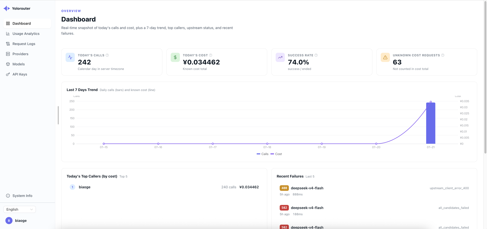
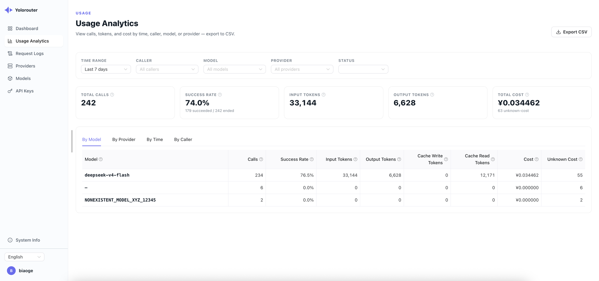

<div align="center">

# Yolorouter

**自托管、兼容 OpenAI 的 LLM 网关：多供应商 failover、上游 Key 自动切换，内置管理后台。**

[](LICENSE)
[](https://github.com/yolorouter/yolorouter/actions/workflows/ci.yml)
[](https://goreportcard.com/report/github.com/yolorouter/yolorouter)
[](https://github.com/yolorouter/yolorouter/releases)
[](go.mod)

[English](README.md) · 简体中文

[快速开始](#快速开始) · [配置](#配置) · [架构](#架构) · [贡献](#贡献)

</div>

---

让你的应用只对接**一个**入口、**一个** API Key。Yolorouter 位于应用和上游供应商之间，
把那些繁琐的事——管理多个供应商账号、切换被限流的 Key、账号失效时自动 failover、
按 Key 控制预算、看清成本——都收拢到一处，而不是散落在每个代码库里。

它兼容 OpenAI Chat Completions API（含流式和函数调用），是**即插即用**的替代：
只改 base URL 和 Key，其余不动。

一切都打包成**单个二进制**，管理后台已内嵌。无需 Node 运行时、无需单独部署前端、
无需外部依赖——SQLite 开箱即用，需要时可切 PostgreSQL。

## 为什么用 Yolorouter

- **兼容 OpenAI** — `POST /v1/chat/completions`、流式 SSE、`tools` / `tool_choice` 函数调用全部透传。
- **多供应商 failover** — 把一个对外模型名（如 `smart`）映射到有序的供应商候选列表。某个不可用时自动切到下一个，调用方全程只看到同一个对外模型名。
- **上游 Key 自动切换** — 每个供应商配一个 Key 池。限流、认证失败、额度不可用的 Key 会被自动跳过，请求先尝试下一个 Key，再决定是否 failover。
- **模型别名** — 调用方用稳定的对外名；每个供应商候选把它映射到该供应商实际接受的模型 id。
- **按 Key 访问控制** — 每个签发的 Key 携带模型白名单、请求速率 / 并发限制、累计预算上限、可选过期时间，支持即时吊销。
- **流式做对了** — Key 切换与 failover 都发生在首字节抵达客户端**之前**；一旦开始流式，供应商即被锁定，绝不把两个供应商的内容拼进同一个响应。
- **内置可观测性** — 概览仪表盘、用量与成本分析（按模型 / 供应商 / 时间 / 使用人）、含完整逐次尝试路由链的请求日志。任意视图可导出 CSV。
- **双语后台** — 简体中文与 English，登录前后随处可切。
- **自更新** — 二进制可检查并应用新版本。

## 截图

<p align="center">
  
  
</p>

## 快速开始

### 一键安装为服务

把 yolorouter 安装成开机自启的后台服务（Linux 用 systemd，macOS 用 launchd）：

```bash
curl -fsSL https://raw.githubusercontent.com/yolorouter/yolorouter/main/scripts/install.sh | bash
```

脚本第一步让你选界面语言（中文/英文），随后自动探测系统架构、下载并做 sha256
校验、建立一个自包含的 app-home 目录，最后启动服务并做健康检查。重跑同一条命令
即可升级（配置和数据库原样保留，升级前会先自动备份数据库）。卸载：

```bash
curl -fsSL https://raw.githubusercontent.com/yolorouter/yolorouter/main/scripts/install.sh | bash -s -- --uninstall
```

可选环境变量覆盖：`YOLO_LANG=zh|en`、`YOLO_SCOPE=system|user`、
`YOLO_VERSION=vX.Y.Z`、`YOLO_REPO=owner/repo`。系统级安装需要 root/sudo；没有时脚本
会自动退回用户级服务。

### 运行发布二进制

从[最新发布](https://github.com/yolorouter/yolorouter/releases)下载对应平台的压缩包，解压后：

```bash
./yolorouter serve
```

首次运行会生成 `configs/config.yaml`（含用于加密上游 Key 的随机 AES-256 主密钥）、
执行数据库迁移，并在 <http://localhost:8080> 启动后台。打开它，创建首个管理员账号，
按引导操作：添加供应商和上游 Key，创建模型及其供应商候选，然后签发 API Key。

### 调用

```bash
curl http://localhost:8080/v1/chat/completions \
  -H "Authorization: Bearer sk-yr-your-key" \
  -H "Content-Type: application/json" \
  -d '{
    "model": "smart",
    "messages": [{"role": "user", "content": "你好！"}]
  }'
```

`model` 是你配置的对外名——Yolorouter 挑选供应商、替换成真实的上游模型 id，
并返回保持对外模型名的 OpenAI 兼容响应。加 `"stream": true` 走 SSE，
或加 `tools` 数组走函数调用。

## 配置

配置位于 `configs/config.yaml`，首次运行自动生成，通常无需手改。

```yaml
server:
  port: 8080
database:
  driver: sqlite          # sqlite | postgres
  sqlite_path: ../data/yolorouter.db
  # driver 为 postgres 时需要 host/port/user/password/dbname/sslmode
security:
  provider_master_key: "" # base64 AES-256 密钥；留空时自动生成
update:
  enabled: true           # 设为 false 可关闭更新检查 API 与 CLI
  github_repo: ""          # 更新检查的 "owner/repo" 覆盖项
```

完整带注释的参考见 [`configs/config.example.yaml`](configs/config.example.yaml)。
若配置文件已存在，`provider_master_key` 必须是真实密钥——只有在"首次生成"路径下才会自动填充。

CLI 子命令：

```bash
./yolorouter serve         # 启动 HTTP 服务
./yolorouter db:migrate    # 执行迁移
./yolorouter update        # 自更新到最新版本
./yolorouter --version
```

## 从源码构建

依赖：**Go 1.26+** 与 **Node.js 22.12+**。

```bash
# 仅后端——提供占位页而非后台
make build          # -> ./bin/yolorouter

# 内嵌后台的完整二进制
make build-embed    # -> ./bin/yolorouter（构建并嵌入前端）
```

## 开发

```bash
./scripts/dev.sh              # 重建前后端、迁移、（重）启动
./scripts/dev.sh --backend    # 仅后端
./scripts/dev.sh --frontend   # 仅前端
./scripts/dev.sh --help       # 全部模式 + 环境变量（YOLO_LANG、NO_COLOR）

make test                     # go test ./...
make vet                      # go vet（plain + -tags release）
```

完整流程与代码规范见 [CONTRIBUTING.md](CONTRIBUTING.md)。

## 架构

- **后端** — Go（[Gin](https://gin-gonic.com/) + [GORM](https://gorm.io/)），迁移用 [goose](https://github.com/pressly/goose)。分层 handler → service → repository。
- **前端** — Vue 3 + TypeScript + [naive-ui](https://www.naiveui.com/)，Vite 构建，经 `go:embed` 嵌入二进制。
- **存储** — SQLite（纯 Go、零配置）或 PostgreSQL。上游 Key 以 AES-256 静态加密存储。

## 状态与范围

Yolorouter 处于 **v0.1**——核心闭环（配置供应商 → 带 failover 路由 → 观测用量与成本）
已完成并有测试覆盖，目标是 OpenAI Chat Completions API。

当前不在范围内：非 OpenAI 请求格式（Claude / Gemini）、图片理解、熔断状态机。
v0.1 成本以单一币种展示。

## 贡献

欢迎提 Issue 和 PR。请先阅读 [CONTRIBUTING.md](CONTRIBUTING.md) 与
[行为准则](CODE_OF_CONDUCT.md)。报告安全问题见 [SECURITY.md](SECURITY.md)。

## 许可证

基于 [Apache License 2.0](LICENSE) 授权。
